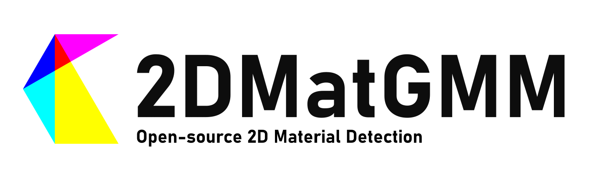

# 2DMatGMM: An open-source robust machine learning platform for real-time detection and classification of 2D material flakes



[](https://arxiv.org/abs/2306.14845)
[](https://iopscience.iop.org/article/10.1088/2632-2153/ad2287)
[](https://flakedemo.uslu.tech)
[](LICENSE)
[](https://doi.org/10.5281/zenodo.8042835)
[](https://colab.research.google.com/drive/1pcAHflZPICLbKerWgPH2qr7yqvgsR1_S?usp=sharing)
[](#Citing2DMatGMM)

This repository hosts the code and related resources for the 2DMatGMM project, a robust machine learning system designed to detect and classify 2D material flakes in real-time. The details of the project are published on arXiv in the paper titled "[An open-source robust machine learning platform for real-time detection and classification of 2D material flakes](https://arxiv.org/abs/2306.14845)".

## Updates

**2024/12/13** New Paper!📃  
We published a new paper on ArXiv called  
[**MaskTerial: A Foundation Model for Automated 2D Material Flake Detection**](https://arxiv.org/abs/2412.09333).  
It builds on this paper and introduces new extensions for the GMM using deep-learning and improves detection metrics for low contrast materials as well as other materials!
We are currently waiting for it to be accepted, afterwards we will publish the full code!
The Code Repo can be found [here](https://github.com/Jaluus/MaskTerial)!

## Features

- **Real-time detection:** The model can detect flakes in real-time on a standard laptop without the need for a GPU.
- **Simple Yet Robust:** The model is based on a simple Gaussian Mixture Model (GMM) and a Logistic Classifier making it robust to Camera Noise, SiOx variation and Brightness differences.
- **Open-Source:** Any code and dataset used in the project is open-source and available under an MIT license making it possible to modify, extend and use the project for any purpose.
- **Interpretable and Physics-based:** The model uses well understood features reported on by literature and can be easily interpreted and validated.

## Repository Structure

The paper comprises three repositories each containing a part of the project:

- [**2DMatGMM**](https://github.com/Jaluus/2DMatGMM): The code for the machine learning model and the detection algorithm.
- [2DMatGMM-System](https://github.com/Jaluus/2DMatGMM-System): The full detection system used in the laboratory.
- [2DMatGMM-Website](https://github.com/Jaluus/2DMatGMM-Website): The code for the website to analyse, filter and download the flakes.

## Dataset

This Repository contains the dataset used in the paper. The dataset will be made available for download on [Zenodo](https://doi.org/10.5281/zenodo.8042835). It is currently privately hosted.
The download links as well as metadata about the dataset and usage can be found in the [Dataset Guide](./Datasets/README.md).

## Installation

To install and set up your system to use 2DMatGMM, follow the [installation instructions](INSTALL.md).

## Getting Started

This repository comes with weights pretrained on the datasets used in the paper.
To use the detector for you own projects check out the [Getting Started](GETTING_STARTED.md) guide.

## Quick Start

You may also quickly hop in by trying out the demo on Google Colab. The demo is a Jupyter Notebook which runs the detector on a few demo images from the testset of the Graphene Dataset.

[](https://colab.research.google.com/drive/1pcAHflZPICLbKerWgPH2qr7yqvgsR1_S?usp=sharing)

## <a name="Citing2DMatGMM"></a>Citing 2DMatGMM

If you use our work or dataset in your research or find the code helpful, we would appreciate a citation to the original paper:  
`Jan-Lucas Uslu et al 2024 Mach. Learn.: Sci. Technol. 5 015027`

```bibtex
@article{Uslu_2024,
doi = {10.1088/2632-2153/ad2287},
url = {https://dx.doi.org/10.1088/2632-2153/ad2287},
year = {2024},
month = {feb},
publisher = {IOP Publishing},
volume = {5},
number = {1},
pages = {015027},
author = {Jan-Lucas Uslu and Taoufiq Ouaj and David Tebbe and Alexey Nekrasov and Jo Henri Bertram and Marc Schütte and Kenji Watanabe and Takashi Taniguchi and Bernd Beschoten and Lutz Waldecker and Christoph Stampfer},
title = {An open-source robust machine learning platform for real-time detection and classification of 2D material flakes},
journal = {Machine Learning: Science and Technology},
}

```

## Contact

If you encounter any issues or have questions about the project, feel free to open an issue on our GitHub repository.
This Repo is currently maintained by [Jan-Lucas Uslu](mailto:jan-lucas.uslu@rwth-aachen.de).
